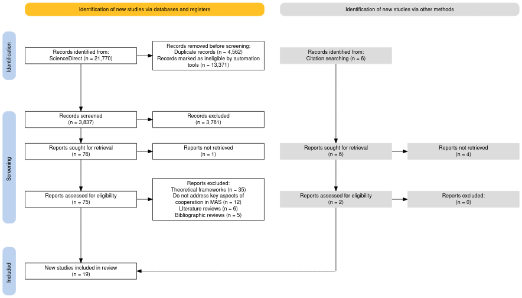
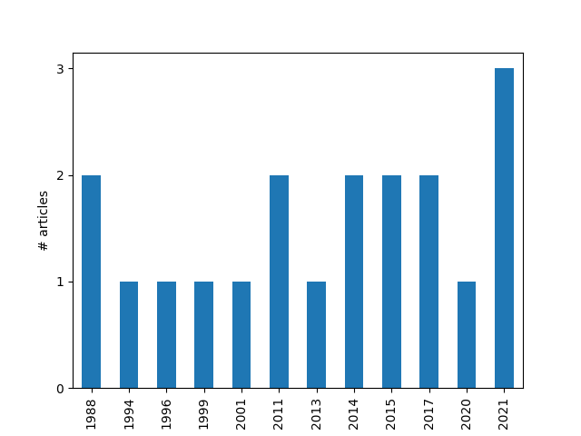
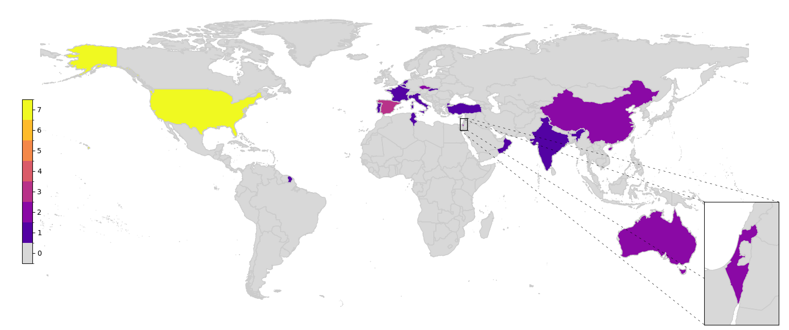
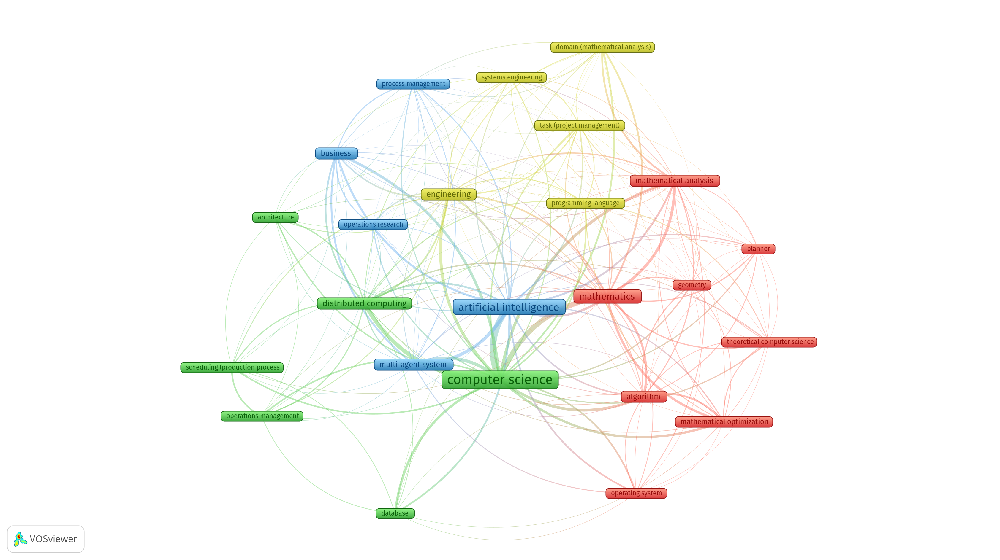

# Conflict Solving and Cooperated Planning in Multi-agent Systems: A Scoping Review

Grigorii Matiukhin^1^

Peoples' Friendship University of Russia named after Patrice Lumumba, Moscow, Russian Federation

E-mail: contact@gmatiukhin.site

## Abstract

**Background**: Multi-agent systems (MAS) represent a critical area of artificial intelligence, focusing on how autonomous agents interact to achieve shared or conflicting goals. As MAS are increasingly deployed in complex and dynamic environments, the ability to resolve conflicts and enable cooperation among agents becomes essential. Despite the growing interest in MAS, a comprehensive mapping of existing strategies for conflict solving and cooperative planning is lacking.

**Purpose**: This scoping review aims to systematically explore and evaluate existing methodologies for cooperation and conflict resolution in MAS. The review identifies key frameworks, strategies, and challenges to inform future research directions.

**Method**: Following the PRISMA-ScR guidelines, a systematic literature search was conducted in ScienceDirect and complementary databases. A total of 21,770 studies were initially identified, reduced to 19 relevant articles after screening based on eligibility criteria. Both qualitative and quantitative methods were used to synthesize findings, including domain modeling techniques, conflict resolution algorithms, and cooperative planning mechanisms.

**Results**: The review highlights diverse approaches to modeling MAS, such as constraint satisfaction problems, hierarchical task networks, and temporal frameworks. Conflict resolution strategies include constraint relaxation, negotiation models, and argumentation-based reasoning, each offering varying levels of scalability, adaptability, and computational efficiency. Cooperative mechanisms emphasize decentralized control, hierarchical task decomposition, and dynamic adaptability, promoting scalability and fault tolerance. However, significant gaps remain in evaluation metrics and real-world testing.

**Conclusion**: This review underscores the strengths and limitations of existing methodologies, emphasizing the need for standardized evaluation frameworks and robust real-world applications. Future research should focus on enhancing adaptability, scalability, and computational efficiency to meet the demands of increasingly complex MAS environments.

**Keywords**: Conflict Solving; Cooperative Planning; Multi-agent Systems; Scoping Review

## Introduction

Multi-agent systems (MAS) have become a cornerstone of artificial intelligence, providing distributed solutions for complex, dynamic environments [@Torre_o_2017]. Their applications span autonomous vehicles, smart grids, robotics, and resource management, enabling decentralized decision-making that promotes scalability, adaptability, and fault tolerance. MAS are particularly suited for domains requiring robust cooperation and dynamic conflict resolution, making them integral to modern technologies.

While MAS frameworks have advanced significantly, challenges remain in achieving seamless cooperation and resolving conflicts among agents [@galesloot2024factoredonlineplanningmanyagent; @zhang2014formalanalysisrequiredcooperation]. Methods such as constraint satisfaction problems (CSPs) [@KOMENDA201476] and negotiation-based models [@GROSZ1996269; @RABELO1994303] have shown promise, yet their scalability and adaptability to real-world, dynamic settings often fall short. Evaluation standards and metrics for comparing approaches also lack consistency, complicating their assessment and deployment.

This review addresses these challenges by systematically mapping existing methodologies and identifying gaps in research. Following the PRISMA-ScR [@prisma-src] framework, it synthesizes findings on modeling approaches, conflict-solving strategies, and cooperation mechanisms, offering insights into the strengths and limitations of current techniques. The goal is to inform future developments in scalable, efficient, and adaptable MAS frameworks, enabling their broader adoption in complex environments.

The primary objectives of this scoping review are:  
RQ#1. Highlight common approaches to domain modeling in MAS planning.  
RQ#2. Identify strategies for conflict resoulution between agents in MAS.  
RQ#3. Determine the mechanisms that enable cooperation in MAS.  
RQ#4. Assess the effectiveness of different frameworks and strategies.

## Methods

### Protocol and Registration

This scoping review adheres to the guidelines set forth by the PRISMA-ScR
(Preferred Reporting Items for Systematic Reviews
and Meta-Analyses extension for Scoping Reviews)
framework to ensure transparency and systematic reporting.
The study's objective, research questions, eligibility criteria,
and search strategy were defined before initiating the data collection process.
The protocol was not registered in PROSPERO,
as scoping reviews fall outside the platform's registration scope.
Any deviations from the original protocol are be documented
in the "Limitations" section of the final manuscript.

### Transparency Statement

The study is conducted with full transparency,
and this section provides an accurate and detailed account of all methodological steps.
No significant aspects of the process are omitted,
and any methodological decisions are documented.
Any discrepancies between the original plan and the actual
review process are explicitly detailed in this report.

### Eligibility Criteria

The review follows the Population, Concept, Context (PCC) framework for eligibility criteria [@afc61c6cf471416489e36a4bc382d3b9].

This review includesstudies focused on the methods for cooperation in
systems with multiple autonomous agents. For the purposes of this review
we use a broad definition of an "autonomous agent".
An "autonomous agent" is an intelligent entity capable of percieveing its
environmnet, making decisions, and taking actions independently
to achieve specific goals. Its autonomy includes bounded rationality,
allowing for efficient decision-making within computational
and communication constraints. Crucially, this definition does not limit
an "autonomous agent" to being a robot, unmanned surface vehicle or aircraft.

Both qualitative and quantitative primary research studies are eligible.
Editorials, commentaries, and opinion pieces as well as conference abstracts are excluded.

: **Table 1:** Inclusion/Exclusion Criteria

| Criterion         | Inclusion                                                                                                                                                                 | Exclusion                                                                            | Justification                                                                                                                                 |
| ----------------- | ------------------------------------------------------------------------------------------------------------------------------------------------------------------------- | ------------------------------------------------------------------------------------ | --------------------------------------------------------------------------------------------------------------------------------------------- |
| Population        | Systems with multiple autonomous agents. This includes systems in both real environments (robotic swarm, delivery robots) as well as in virtual or simulated ones.        | Systems with one one agent.                                                          | The focus of the review is conflict solving and cooperation which is to model in systems with only one agent.                                 |
| Concept           | Algorithms that are used to enable cooperation between autonomous agents in MAS.                                                                                          | Algorithms that focus on single-agent systems.                                       | The review is focused on algorithms that facilitate cooperation in MAS.                                                                       |
| Context           | Studies which focuse on developing algorithms to enable cooperated planning and conflict solving in systems with multiple autonomous agents with artificial intelligence. | Studies focused on conflict solving outside of the field of artificial intelligence. | The review is focused on the algorithms used in the field artificial intelligence, therefor all other fields are irrelevant for its purposes. |
| Language          | English, Russian, German                                                                                                                                                  | Other                                                                                | Reviewers speak only English, Russian and German and do not have the resources to translate articles from other languages.                    |
| Types of articles | Peer-reviewed scientific articles, empirical research                                                                                                                     | Non-peer-reviewed articles, commend, letters to the editor.                          | The use of peer-reviewed sources ensures the reliability and scientific validity of the data presented in the review.                         |
| Geographic        | Any                                                                                                                                                                       | None                                                                                 | Research of conflict solving in multi-agent systems does not depend on the country of origin.                                                 |
| Time period       | Any                                                                                                                                                                       | None                                                                                 | There is not a lot of research in this field, so the decision was made to focuse on all the literature available.                             |

### Information Sources

The literature search was conducted primarily in ScienceDirect,
chosen for its extensive repository of peer-reviewed
articles relevant to conflict solving and cooperation in multi-agent systems.
Additional citation searches were performed to enrich this review with important studies,
that might have been missed by the database search.
The reference lists of included studies were manually
reviewed to identify other potentially relevant sources.

### Search Strategy

The search strategy was thoroughly crafted to systematically identify
scholarly articles that address cooperation in MAS.
Initially, an exploratory search was conducted to uncover relevant
terminology and discern prevailing research themes within the field.
This foundational phase was critical for fine-tuning the search keywords,
ensuring that subsequent queries were both precise and comprehensive.
To enhance the effectiveness of the search,
advanced techniques such as Boolean operators and truncation symbols were employed.
These methods facilitated the inclusion of a wide range of lexical
variations and synonymous terms, thereby broadening the scope of the literature review.
The iterative nature of the search process allowed for continuous refinement,
adapting to emerging patterns and insights uncovered during the review.
Beyond automated database searches,
the strategy incorporated manual reviews of reference lists from selected studies.
This supplementary approach was instrumental in identifying seminal works
and additional sources that might have been overlooked by electronic searches alone.
By integrating both automated and manual search methods,
the strategy ensured a thorough examination of linguistic nuances,
cultural intricacies, and domain-specific challenges within MT.
Ultimately, this comprehensive search strategy provided a robust foundation for the review,
enabling a deep and nuanced understanding of
various methodologies aimed at enabling cooperation in MAS.

The following search queries were used:

- multi-agent systems AND conflict solving
- cooperated planning AND conflict solving
- multi-agent systems AND cooperated planning
- multi-agent systems AND (cooperated planning OR conflict solving)

### Selection of Sources of Evidence

The titles and abstracts of the retrieved articles were be screened by one reviewer.
If there is any uncertainty about whether to include an acricle
based on the initial screning, it were also be included for full-text evaluation.
Articles that are identified as potentially meeting the inclusion/exclusion criteria
were advanced to the full-text review.
Similar to the title and abstract screening the articles were assessed by one reviewer.
The final results of the search, including the number of articles screened,
included and excluded at each stage was illustrated in a PRISMA flow diagram,
as recommended by the PRISMA-ScR guidelines. This is visually represent
the study selection process and ensure adherence to reporting standards.

### Data Charting Process

Data was extracted by one member of the research team into Microsoft Excel software
following guidelines from JBI [@afc61c6cf471416489e36a4bc382d3b9].
Data to be extracted included study characteristics
and characteristics of multi-agent autonomous systems related to our research questions.

### Data Items

### Synthesis of Results

#### Collating and Summarising the Results

The initial analysis involved both quantitative and qualitative approaches.
A descriptive numerical summary of the studies was conducted,
covering aspects such as the number of studies, publication years, study populations,
and key methodologies used.
A deductive content analysis was performed based on the research questions,
and a narrative summary accompanies the tabular results.

#### Reporting

Results are reported in line with the PRISMA-ScR guidelines.
A PRISMA flow diagram illustrates the study selection process,
including reasons for exclusion during the full-text review.
Quantitative results are presented in tables and organized in a narrative summary
aligned with the research questions.

## Results

### Selection of Sources of Evidence

A total of 21,770 studies were identified through the ScienceDirect database
using the search queries specified in this review.
After removing duplicates, 4562 duplicate entries (20.95%) were excluded,
resulting in 17,203 unique records.
Automation tools were used to remove 13,371 studies (82.37%) deemed ineligible based
on irrelevance to the topic or lack of sufficient empirical or theoretical data on
multi-agent systems and cooperation and conflict solving within them.
The titles and abstracts of the remaininng 3837 (17.62%) studies were
screened in accordance with the inclusion and exclusion criteria.

After this process the remaining 76 records (0.34%) were sought for retrieval,
but to a manual review were subjected only 75 of them.
Upon further examination, 58 studies (77.33%) were excluded for the following reasons:

- 35 studies (46.67%) focused solely on theoretical frameworks;
- 12 studies (16.00%) did not address the key aspects of cooperation in MAS or designing a MAS in general,
  such as domain modeling or a description of the algorithm;
- 6 studies (8.00%) were systematic literature reviews without detailed methodological insights;
- 5 studies (6.67%) were bibliographic reviews without original empirical findings;
- Finally, a total of 17 studies (0.07% of the total records) were included in this review.

Additional 6 studies were identified by citation searching.
However, only 2 of those were retrieved.

Together these 19 studies provided relevant empirical data, theoretical frameworks,
and insights into conflict solving methdologies and cooperation algorithms in MAS,
and domain-specific terminology.

#### Timeframe Analysis

The timeline of publications shows a steady, albeit slow, rate
of new articles starting in 1988 to 2001.
Then a ten year gap unitl 2011, and twice as many articles starting from then
until 2021 which is the last year that has articles relevant to this review.
The most articles (three) were published in 2021.
every two years.
This shows both the age of the field,
as well as, the almost unwavering interest in it.

#### Geographical Distribution of Publications

Including collaborations, the USA leads the field with seven publications,
taking part in more than a third of all articles.
respectively (including collaborations).
Spain takes the second place with three articles.
China, Australia, Israel and Czechia have contributed two studies each.
Meanwhile, India, Italy, Portugal, Slovakia,
Belgium, Oman, France, Tunisia, Turkey and the Netherlands --- only one each.

### Defining Current Trends

Analyzing the data retrieved from the articles, we can see
four distinctive areas:

**Mathematics:** This cluster (in red) emphasizes mathematical modeling,
optimization techniques, and algorithm design.
Strong connections exist between "mathematics" and "mathematical analysis",
reflecting theoretical foundations, and between "mathematics" and "algorithm",
highlighting computational strategies.

**Computer Science:** This cluster (in green)
is focused on system architecture,
data handling, and distributed systems.
Notable links include "computer science" with "distributed computing"and "database",
illustrating computational methods for data-intensive tasks.

**Artificial Intelligence:** This cluster (in blue)
addresses intelligent systems,
decision-making, and process optimization.
Strong associations appear between "artificial intelligence" and "multi-agent systems"
and between "AI" and "process management".

**Engineering and Systems Development:** This cluster (in yellow)
is centered on implementation and systems engineering,
opposing the more theoretical clusters taht came before.
Significant connections link "systems engineering" and "task management"
and "mathematical analysis" with "task management",
underlining the integration of analytical methods in project design.

However, the strongest connections span clusters,
particularly between mathematical foundations and computational systems.
Links such as "mathematics" and "computer science"
show that mathematics underpins computer science
while "algorithm" and "artificial intelligence" link
highlights algorithmic integration into AI.
Interdisciplinary ties between "distributed computing" and "multi-agent systems"
underscore distributed approaches in cooperative planning,
and connections between "engineering" and "artificial intelligence"
emphasize that although the reviewed articles deal mostly in theoretical
applications, real-world needs are still being addressed by them.
All of this is not surprising, as it just shows the
natural order of things in the subject area of our research,
namely --- Computer Science.

### Synthesis of Results

#### Problem Modeling

##### Domain Representation

Algorithmic approaches to conflict resolution and cooperative planning in multi-agent systems commonly rely on defining structured domains where agents interact. These domains are modeled using formal representations such as constraint graphs [@SHARON201540; @SEMIZ2021220], hierarchical task networks [@FRANKOVIC20017], and blackboard architectures [@DURFEE1988268]. Such formalisms facilitate the clear delineation of goals, constraints, and interdependencies between agents [@GROSZ1996269]. Constraint satisfaction problems are often employed as mathematical models to capture decision-making requirements and constraints [@KOMENDA201476]. By leveraging these formalisms, agents can operate autonomously while ensuring coherence with shared objectives.

##### State and Goal Representation

State-based modeling approaches enable agents to track their progress and assess changes in the environment dynamically. Problems are typically framed as transitions between states, with actions defined to achieve specified goals [@CHOUHAN2015396]. Agents maintain localized views of the environment, augmented by shared constraints and capabilities to align actions globally [@ROSENSCHEIN1988187]. Goals may be defined explicitly as endpoint objectives or implicitly through utility functions that evaluate performance [@MA2021103823]. Furthermore, models often incorporate probabilistic reasoning to account for uncertainty, thereby enhancing robustness and decision-making reliability [@WU2011487].

##### Temporal and Dynamic Modeling

Given the dynamic nature of multi-agent systems, many approaches integrate temporal modeling techniques to manage evolving environments [@MA2021103823; @LU2014215]. Workflows and event-driven frameworks are utilized to structure task sequences and coordinate execution under changing conditions. Temporal constraints provide bounds on task execution windows, ensuring synchronization among agents. Dynamic updates through incremental planning mechanisms enable real-time adaptability, as observed in frameworks utilizing iterative refinement and incremental adjustments [@SEMIZ2021220]. These methodologies allow systems to respond to unforeseen changes without requiring complete replanning.

#### Conflict Resolution Strategies

##### Constraint Satisfaction and Relaxation

Constraint satisfaction and relaxation techniques form the backbone of conflict resolution in multi-agent systems. Algorithms such as Conflict-Based Search address conflicts by incrementally refining solutions through constraint addition or relaxation [@SHARON201540]. These strategies rely on iterative evaluations to resolve conflicts efficiently while preserving optimality. In more dynamic settings, incremental adjustments allow systems to address unexpected conflicts in real time without resorting to full plan revisions [@KOMENDA201476].

##### Negotiation and Bidding

Negotiation-based approaches leverage task allocation mechanisms, including bidding and auction models, to distribute resources and tasks among agents [@GHARRAD2021108282; @FRANKOVIC20017; @RABELO1994303]. These methods emphasize cooperative interactions, where agents iteratively refine agreements based on priorities and constraints. By enabling flexibility in task redistribution, these approaches enhance scalability and responsiveness to changing conditions. Dynamic adjustments and renegotiation cycles ensure the resolution of emerging conflicts during execution.

##### Argumentation and Meta-Reasoning

Several frameworks incorporate argumentation-based reasoning, enabling agents to engage in structured dialogues to resolve conflicts [@PAJARESFERRANDO201322; @FERRANDO20171]. Argumentation frameworks evaluate competing claims, identify inconsistencies, and reach agreements through meta-reasoning processes. This approach is particularly effective in scenarios requiring explanation-based negotiation or where decisions must be justified within collaborative contexts. By modeling belief updates and preference adjustments, argumentation mechanisms support transparent decision-making and adaptability.

#### Cooperation Mechanisms

##### Distributed and Decentralized Control

Distributed planning methodologies form the foundation of cooperative multi-agent systems. These approaches eschew centralized control [@DURFEE1988268; @GRASTIEN2020103271; @MA2021103823] in favor of decentralized frameworks where agents operate independently but coordinate through shared communication protocols [@ROSENSCHEIN1988187]. This structure enhances scalability, fault tolerance, and resilience by minimizing reliance on centralized decision-makers. Protocols facilitate the exchange of constraints and updates, enabling agents to synchronize actions and optimize resource usage collaboratively.

##### Task Decomposition and Hierarchies

Hierarchical task decomposition techniques divide complex problems into smaller, manageable subtasks, enabling parallel execution and refined control [@JUNG1999149]. Such methods leverage layered planning structures, where higher-level goals guide low-level actions. Hierarchies support conflict resolution by isolating dependencies within task groups, thus simplifying the management of inter-agent interactions. This structure also promotes scalability and modular planning [@RODRIGUEZ201113005], making it suitable for large-scale systems.

##### Dynamic Updates and Adaptability

Dynamic adaptability mechanisms ensure that multi-agent systems remain responsive to changes in the environment. Feedback loops and iterative learning techniques allow agents to continuously evaluate performance and refine plans based on observed outcomes [@LU2014215]. Mechanisms such as plan repair and incremental adjustments enhance resilience by minimizing disruptions during execution. These features are particularly critical in dynamic domains where conditions evolve unpredictably.

#### Evaluation of Effectiveness

Evaluating the effectiveness of the methodologies discussed reveals strengths and trade-offs across different approaches. Constraint satisfaction techniques are lauded for their mathematical rigor and scalability, making them particularly effective in structured domains where constraints can be explicitly defined [@STOLBA2017175]. However, these methods may struggle in highly dynamic or uncertain environments without additional adaptive layers [@SHARON201540].

Negotiation-based approaches exhibit flexibility and adaptability by enabling dynamic task allocation. Their iterative refinement and renegotiation capabilities make them suitable for open, evolving environments. Nonetheless, their reliance on communication protocols may introduce overhead in scenarios with limited bandwidth or latency constraints [@PAJARESFERRANDO201322].

Argumentation frameworks excel in domains requiring justifications and explanations, offering transparency and trust in collaborative decision-making. However, their computational complexity can be a limiting factor, particularly in large-scale systems with numerous agents [@FERRANDO20171].

Cooperative mechanisms based on distributed control and hierarchical decomposition demonstrate high scalability and fault tolerance, proving effective in large, decentralized systems [@MA2021103823]. Despite these advantages, they may require sophisticated coordination protocols to ensure consistency, especially in scenarios involving heterogeneous agents [@JUNG1999149].

Dynamic adaptability techniques enhance resilience and responsiveness, making them indispensable in environments characterized by uncertainty and change [@LU2014215]. Nevertheless, their performance often hinges on the quality of feedback mechanisms and the ability to balance exploration and exploitation effectively.

## Discussion

### Summary of evidence

This review examines conflict-solving strategies and cooperative mechanisms in multi-agent systems, emphasizing modeling approaches, resolution strategies, and cooperation frameworks. Formal representations such as constraint satisfaction problems , hierarchical task networks, and temporal models provide structural foundations for problem-solving [@GROSZ1996269; @KOMENDA201476]. These methods enable agents to handle constraints and uncertainties while maintaining coordination through state-based reasoning and incremental updates [@STOLBA2017175; @LU2014215].

Conflict resolution strategies leverage constraint satisfaction, negotiation-based approaches, and argumentation frameworks. Techniques like Conflict-Based Search incrementally refine solutions, ensuring optimal performance in dynamic environments [@SHARON201540]. Negotiation and bidding mechanisms enhance flexibility by dynamically reallocating resources, though they introduce communication overhead [@PAJARESFERRANDO201322; @FRANKOVIC20017]. Argumentation methods prioritize transparency but face scalability challenges in larger systems [@FERRANDO20171].

Cooperation mechanisms, including distributed control and task hierarchies, enable scalability and fault tolerance by decentralizing decision-making and structuring tasks into manageable components [@MA2021103823; @JUNG1999149]. Dynamic adaptability techniques further enhance resilience through iterative learning and feedback loops [@SEMIZ2021220].

Effectiveness varies across approaches, with constraint models excelling in structured domains, negotiation strategies adapting to dynamic changes, and argumentation frameworks promoting explainability. However, scalability, adaptability, and computational overhead remain challenges, emphasizing the need for improved evaluation benchmarks and generalizable frameworks. Future research must address these limitations to ensure robust and scalable solutions for real-world applications.

### Limitations

Several potential limitations can be identified.

#### Lack of Uniform Evaluation Standards

The lack of uniform cross-domain evaluation metrics across studies
poses a challenge for meaningful comparisons.
For example, some studies emphasize computational efficiency,
while others prioritize adaptability or stability.

#### Dependence on Simulation-Based Evidence

A significant proportion of evidence in the reviewed studies comes
from simulations rather than real-world implementations.
While simulations offer controlled testing,
they may not fully capture the challenges of deploying MAS in dynamic,
real-world environments.

Addressing these limitations in future iterations
through broader inclusion criteria, standardized metrics, and integration
of real-world case studies can enhance the review’s comprehensiveness and relevance.

## Conclusion

This scoping review provides a systematic examination of methodologies and frameworks employed for conflict resolution and cooperative planning in multi-agent systems. The findings highlight the strengths and limitations of current approaches, including constraint satisfaction problems, negotiation models, and decentralized frameworks. While these methods demonstrate scalability, adaptability, and computational efficiency, gaps remain in evaluation metrics and real-world applications.

The study emphasizes the need for standardized benchmarks and performance metrics to ensure comparability across frameworks. Additionally, future research should focus on integrating dynamic adaptability and real-world implementation to address evolving challenges in MAS environments. Enhancing scalability and robustness through hybrid methodologies and advanced learning techniques will be crucial for the continued advancement of MAS applications.

By identifying research gaps and synthesizing existing approaches, this review provides a foundation for further exploration, ensuring that MAS technologies remain effective and reliable in increasingly complex environments.

## References

::: {#refs}
:::
